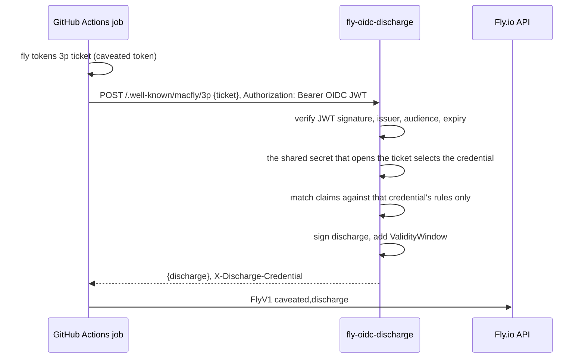

# fly-oidc-discharge

A service that mints short-lived Fly.io API tokens inside GitHub Actions
based on OIDC Connect. No (usable) Fly token need to be stored in GitHub secrets.

The problem:

OIDC is a popular form to deploy and authenticate from Github Actions.
[OpenID Connect](https://docs.github.com/en/actions/concepts/security/openid-connect)
lets you scope permissions for a CI workflow so it doesnt need to store
any long-lived credentials to access cloud providers.
Sadly, this isn't supported for fly.io.

The solution:

fly.io implements 'macaroons', a form of signed capabilities. This service bridges OIDC and Macaroons:
In fly.io terminology, it means each Fly token gets a [third-party caveat](https://fly.io/blog/macaroons-escalated-quickly/)
pointing at this service, which leaves the token inert until the service adds a discharge.
This services only adds a discharge after it validates the GitHub OIDC token
and makes sure matches the policy defined in this service.
`fly deploy`, `fly secrets set`, and the rest work unchanged after the service added the discharge.



| What leaks | What the attacker gains |
|---|---|
| Caveated token (GitHub secret) | nothing without a discharge |
| Discharged token (compromised CI step) | that one environment, until the window ends |
| One shared secret (this service) | nothing without the matching caveated token |
| A caveated token and its shared secret | the full access of that one Fly token |

## Run it

You can launch the service using the published image.
It carries no default policy, so you'll have to write your own and deploy it
(probably inside fly.io).

```bash
cp policy.example.yaml policy.yaml   # then edit it
fly launch --flycast --no-deploy     # private app, no public IP, but service can in theory be made public too
fly deploy --image ghcr.io/gz/fly-oidc-discharge:v1
```

`fly.toml` ships the policy in the `[[files]]` section.
Set `OIDC_DISCHARGE_LOCATION` to the URL the runner will use, which must match the caveat
location exactly.

### Reaching it

The default has no public IP, so the caller must be inside the Fly organization's private network.

| Deployment | Location | Reachable by |
|---|---|---|
| Flycast, no public IP (default) | `http://<app>.flycast` | self-hosted runners in the org, or runners joined to a WireGuard or Tailscale path into the private network |
| Public IP | `https://<app>.fly.dev` | any runner, including GitHub-hosted |

Flycast serves plain HTTP, which is why `fly.toml` sets `force_https = false` and `OIDC_DISCHARGE_LOCATION` uses
`http://`. The traffic stays on Fly's private WireGuard mesh, and it still passes through Fly Proxy,
which is what makes autostart work.

For GitHub-hosted runners with no VPN, give the app a public address instead:

```bash
fly ips allocate-v4 --shared
fly ips allocate-v6
```

Then set `force_https = true` and `OIDC_DISCHARGE_LOCATION = "https://<app>.fly.dev"`. A public deployment is
exposed to anyone, so the OIDC check and the policy are all that stand in front of it. Both run
before the ticket is examined.

Outside Fly, mount the policy at `POLICY_FILE` (default `/etc/fly-oidc-discharge/policy.yaml`) or
pass it inline in `POLICY_YAML`.

```bash
docker run -p 8080:8080 \
  -e OIDC_DISCHARGE_LOCATION=https://discharge.example.com \
  -e SHARED_SECRET_PROD="$(cat prod.secret)" \
  -v "$PWD/policy.yaml:/etc/fly-oidc-discharge/policy.yaml:ro" \
  ghcr.io/gz/fly-oidc-discharge:v1
```

Images are built for `linux/amd64` and `linux/arm64` and tagged `vX`, `vX.Y`, `vX.Y.Z`, `main`, and
`sha-<commit>`. A public repository also gets a signed provenance attestation, which GitHub does not
offer for user-owned private ones:

```bash
gh attestation verify oci://ghcr.io/gz/fly-oidc-discharge:v1 --repo gz/fly-oidc-discharge
```

## Wire up a repository

1. Generate one secret per credential and give them to the service.

   ```bash
   for env in PROD STAGING; do openssl rand -base64 32 > "$env.secret"; done
   fly secrets set \
     SHARED_SECRET_PROD="$(cat PROD.secret)" \
     SHARED_SECRET_STAGING="$(cat STAGING.secret)"
   ```

2. Mint one caveated token per environment. Use the same location string everywhere, no trailing
   slash, and the secret belonging to that environment.

   ```bash
   fly tokens create deploy --app my-app-prod --expiry 9999h > prod.tok
   fly tokens 3p add --location http://my-discharge.flycast \
       --secret-file PROD.secret --access-token "$(cat prod.tok)"
   ```

   Best practice: Store the printed `FlyV1 fm2_...` token as a GitHub **environment** secret of the matching
   environment, so only jobs targeting that environment can read it.
   Delete `*.tok`: the caveated token should be the only copy.
   Delete `.secret`: The secret content is only needed where the service runs after tokens are minted.
   If you intent to re-mint new tokens with the same secret, store it in a safe place instead.

3. Add the credential and its rules to `policy.yaml`, then `fly deploy`.

4. Use it in a job.

   ```yaml
   jobs:
     deploy:
       environment: prod
       permissions:
         id-token: write
       steps:
         - uses: superfly/flyctl-actions/setup-flyctl@master
         - id: fly
           uses: gz/fly-oidc-discharge@v1
           with:
             caveated-token: ${{ secrets.FLY_CAVEATED_TOKEN }}
             location: http://my-discharge.flycast
         - run: flyctl deploy
           env:
             FLY_API_TOKEN: ${{ steps.fly.outputs.token }}
   ```

   The refs above are mutable for readability. Pin every action to a full commit
   SHA in a job that holds deployment authority, because a moved ref runs new code
   next to your Fly token.

## Admission Policy

A credential is one Fly token, identified by the shared secret its caveat was sealed with.
The shared secrets are attached to the rules defined in the policy file that need to match in the JWT.
Two credentials sharing a secret is rejected at startup, because a ticket could not select between them.

```yaml
default_discharge_ttl: 15m

credentials:
  - name: prod
    shared_secret_env: SHARED_SECRET_PROD
    discharge_ttl: 10m
    rules:
      - name: prod deploy
        claims:
          repository: acme/web
          job_workflow_ref: acme/web/.github/workflows/deploy.yml@refs/heads/main
          environment: prod

  - name: staging
    shared_secret_env: SHARED_SECRET_STAGING
    rules:
      - name: staging deploy
        claims:
          repository: acme/web
          job_workflow_ref: acme/web/.github/workflows/deploy.yml@refs/heads/main
          environment: staging
```

A job is allowed when every claim of one rule of its credential matches. `*` matches any run of
characters, including `/`. Every rule must pin `repository`, `repository_owner`, `sub`, or
`job_workflow_ref`. Claim names follow the
[GitHub OIDC token](https://docs.github.com/en/actions/security-for-github-actions/security-hardening-your-deployments/about-security-hardening-with-openid-connect#understanding-the-oidc-token);
booleans such as `ref_protected` match as `"true"` or `"false"`.

Rules constrain their own credential and nothing else. A permissive rule stays permissive for that
credential: a rule of `repository` plus `ref` admits any job on that ref, including one that
declares `environment: prod`. Add the `environment` claim to every credential you want restricted to
one environment.

## Configuration

| Variable | Default | Meaning |
|---|---|---|
| `OIDC_DISCHARGE_LOCATION` | required | URL given to `fly tokens 3p add --location` |
| `POLICY_FILE` | `/etc/fly-oidc-discharge/policy.yaml` | policy location |
| `POLICY_YAML` | | policy as inline YAML; takes precedence over `POLICY_FILE` |
| `OIDC_ISSUER` | `https://token.actions.githubusercontent.com` | OIDC issuer to trust |
| `OIDC_AUDIENCE` | `OIDC_DISCHARGE_LOCATION` | `aud` the job must request |
| `LISTEN_ADDR` | `:8080` | HTTP listen address |

Each credential names its own secret variable in the policy, through `shared_secret_env` or
`shared_secret_file`. Discharge lifetime comes from `default_discharge_ttl` and the optional
per-credential `discharge_ttl`.

Another OIDC issuer works as long as its tokens carry claims a rule can pin. Point `OIDC_ISSUER` at
it, and remember that `repository` and `job_workflow_ref` are GitHub-specific claim names.

The issuer's discovery document is resolved on the first token rather than at startup, so a machine
woken by Fly Proxy serves without a network round trip on its startup path and cannot crash-loop
because the issuer was briefly unreachable. Startup attempts to warm it and logs a warning if it
fails, so a wrong `OIDC_ISSUER` shows up as that warning followed by 401s.
